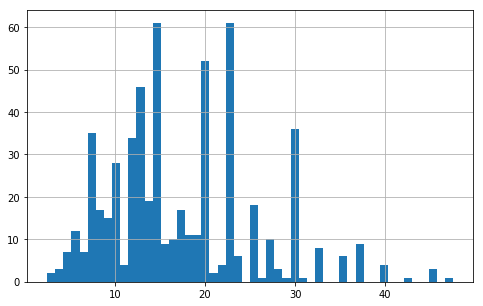

```python
import warnings
warnings.filterwarnings("ignore")
```

# Read Data


```python
import pandas as pd
from pandas import Series
```


```python
data_analysis = pd.read_csv('./data_to_be_analysed/data_analysis_with_skills.csv')
data_mining = pd.read_csv('./data_to_be_analysed/data_mining_with_skills.csv')
machine_learning = pd.read_csv('./data_to_be_analysed/machine_learning_with_skills.csv')
business_analysis = pd.read_csv('./data_to_be_analysed/business_analysis_with_skills.csv')
```

---

## 添加薪资均值


```python
import re
# 均值函数
def average(job_salary):
    # 取薪资均值----------------
    pattern = re.compile('\d+')
    salary = job_salary
    try:
        res = re.findall(pattern, salary)
        avg_salary = 0
        sum = 0
        for i in res:
            a = int(i)
            sum = sum + a
            avg_salary = sum / 2
    except Exception:
        avg_salary = 0
    # 函数返回值
    return avg_salary

salary_list = []
for i in range(0,data_analysis.shape[0]):
    avg_sal = average(data_analysis['职位薪资'][i])
    salary_list.append(avg_sal)
sal = Series(salary_list)

data_analysis.insert(9,'salary',sal)
```


```python
salary_list = []
for i in range(0,data_mining.shape[0]):
    avg_sal = average(data_mining['职位薪资'][i])
    salary_list.append(avg_sal)
sal = Series(salary_list)

data_mining.insert(9,'salary',sal)
```


```python
salary_list = []
for i in range(0,machine_learning.shape[0]):
    avg_sal = average(machine_learning['职位薪资'][i])
    salary_list.append(avg_sal)
sal = Series(salary_list)

machine_learning.insert(9,'salary',sal)
```


```python
salary_list = []
for i in range(0,business_analysis.shape[0]):
    avg_sal = average(business_analysis['职位薪资'][i])
    salary_list.append(avg_sal)
sal = Series(salary_list)

business_analysis.insert(9,'salary',sal)
```

---

# 薪资分布探索


```python
data_analysis.salary.describe()
```


    count    575.000000
    mean      17.446957
    std        8.261053
    min        2.500000
    25%       11.500000
    50%       15.000000
    75%       22.500000
    max       47.500000
    Name: salary, dtype: float64


```python
%matplotlib inline
import matplotlib.pyplot as plt
data_analysis.salary.hist(bins=50, figsize=(8,5))

plt.show()
```





- 薪资主要分布在**5k-30k**之间

---


```python
data_analysis = data_analysis.drop(['Unnamed: 0','Keyword','职位描述','职位薪资'],axis=1)
```


```python
data_mining = data_mining.drop(['Unnamed: 0','Keyword','职位描述','职位薪资'],axis=1)
```


```python
machine_learning = machine_learning.drop(['Unnamed: 0','Keyword','职位描述','职位薪资'],axis=1)
```


```python
business_analysis = business_analysis.drop(['Unnamed: 0','Keyword','职位描述','职位薪资'],axis=1)
```

---

## 掌握的软件技能对薪资的影响关系


```python
corr_matrix = data_analysis.corr()
corr_matrix["salary"].sort_values(ascending=False)
```


    salary     1.000000
    Hive       0.292764
    Hadoop     0.254448
    Python     0.242217
    Sql        0.235256
    Spark      0.216505
    Sas        0.119493
    Tableau    0.044519
    Spss       0.024708
    Ppt       -0.042691
    Excel     -0.140370
    Name: salary, dtype: float64


- **Data Analysis**的职位中，`Hive`,`Spark`,`Hadoop`大数据应用方面的软件是**薪资的加分项**。
- 同时，`Python`,`SQL`,`SAS`,`Tableau`,`SPSS`等统计分析软件与可视化软件也是数据分析师**区别于低薪分析专员**的因素。
- `PPT`,`Excel`作为必须的软件技能，对薪资变化**并没有太大的影响**，甚至仅仅会Excel的职位沦落为专员，会是一个减分项。
- 结论：在数据分析领域，拥有**大数据软件技能**并且懂得**Python**这一编程语言的分析师的待遇较好。


```python
corr_matrix = data_mining.corr()
corr_matrix["salary"].sort_values(ascending=False)
```


    salary    1.000000
    Hive      0.195964
    Spark     0.180962
    Java      0.180336
    Hadoop    0.136721
    C         0.127518
    Python    0.067957
    Shell     0.020722
    Linux    -0.009015
    Sql      -0.052715
    Sas      -0.089915
    Name: salary, dtype: float64


- **Data Mining**的职位中，`Hive`,`Spark`,`Hadoop`大数据方面的软件是薪资**极大的加分项**。
- `Java`,`C`,`Python`等编程语言对数据挖掘的工作有很大帮助因此也体现在了对薪资的**正面影响**上。
- 分析结论：具备**数据挖掘算法与编码能力**且具备**大数据方面分析技能**的数据挖掘工程师的待遇较好。


```python
corr_matrix = machine_learning.corr()
corr_matrix["salary"].sort_values(ascending=False)
```


    salary        1.000000
    Hive          0.095518
    Spark         0.093537
    Java          0.064341
    Tensorflow    0.059785
    Hadoop        0.057670
    Sql          -0.035192
    Linux        -0.036466
    C            -0.052703
    Matlab       -0.058808
    Python       -0.104268
    Name: salary, dtype: float64


- **Machine Learning**的职位中，没有特别突出的技能加分项，列表中的软件技能基本都是入职必备的技能。
- `Hive`,`Spark`,`Hadoop`等大数据方面的技能会对薪资有一定程度的提升，不过影响较小。
- 分析结论：机器学习工程师入门难度稍高，需要掌握具备的软件技能也较多，没有特别突出的薪资加分项。


```python
corr_matrix = business_analysis.corr()
corr_matrix["salary"].sort_values(ascending=False)
```


    salary    1.000000
    C         0.399615
    Python    0.377288
    Linux     0.255181
    Java      0.237707
    Hive      0.153111
    Sql       0.115494
    Sas       0.085293
    Excel     0.059614
    Ppt      -0.057346
    Spss     -0.068219
    Name: salary, dtype: float64


- **Business Analysis**的职位中，编程语言是**极大的薪资加分项**。如`C`,`Python`,`Java`。
- `Excel`,`PPT`,`SPSS`等软件是这个职位的**必备技能**，因此对职位薪资没有太大的影响。
- 结论：在商业分析领域，拥有**商业分析思维**并且具有**编程能力**的分析师的待遇较好。

---

---

# 准备数据


```python
from sklearn.model_selection import train_test_split

train_set, test_set = train_test_split(data_analysis, test_size=0.2, random_state=52)
```


```python
data_train = train_set.copy()
data_test = test_set.copy()
```

```python
from sklearn.pipeline import Pipeline
from sklearn.preprocessing import StandardScaler
from sklearn.preprocessing import Imputer
from sklearn.compose import ColumnTransformer
from sklearn.preprocessing import OneHotEncoder
```


```python
data_analysis_num = data_analysis.drop(['公司名称','公司规模','地区','学历要求','工作经验','职位名称','融资情况','salary'], axis=1)
num_attribs = list(data_analysis_num)
cat_attribs = ['公司规模','学历要求','工作经验','融资情况']

num_pipeline = Pipeline([
        ('std_scaler', StandardScaler()),
    ])

full_pipeline = ColumnTransformer([
        ("num", num_pipeline, num_attribs),
        ("cat", OneHotEncoder(), cat_attribs),
    ])

data_analysis_prepared = full_pipeline.fit_transform(data_train)
data_analysis_test = full_pipeline.transform(data_test)
```


```python
data_analysis_prepared[:1]
```


    array([[-1.04902651, -0.99566158, -0.6853091 , -0.58404441, -0.5       ,
            -0.4307749 , -0.38729833,  2.68594224, -0.37608404, -0.27343437,
             0.        ,  0.        ,  1.        ,  0.        ,  0.        ,
             0.        ,  0.        ,  0.        ,  1.        ,  0.        ,
             0.        ,  0.        ,  0.        ,  0.        ,  1.        ,
             0.        ,  0.        ,  0.        ,  0.        ,  0.        ,
             0.        ,  0.        ,  0.        ,  0.        ,  0.        ,
             0.        ,  0.        ,  0.        ,  0.        ,  1.        ,
             0.        ]])


```python
data_analysis_labels = data_train.salary.values
test_labels = data_test.salary.values
```

---

# 训练模型

## Linear


```python
from sklearn.linear_model import LinearRegression

lin_reg = LinearRegression()
lin_reg.fit(data_analysis_prepared, data_analysis_labels)
```


    LinearRegression(copy_X=True, fit_intercept=True, n_jobs=None,
             normalize=False)


```python
from sklearn.metrics import mean_squared_error
import numpy as np

salary_predictions = lin_reg.predict(data_analysis_prepared)
lin_mse = mean_squared_error(data_analysis_labels, salary_predictions)
lin_rmse = np.sqrt(lin_mse)
lin_rmse
```


    5.402995127278521


```python
#salary_predictions[:10]
```

### 测试集


```python
data_test.head(10)
```


<div>
<style scoped>
    .dataframe tbody tr th:only-of-type {
        vertical-align: middle;
    }

    .dataframe tbody tr th {
        vertical-align: top;
    }

    .dataframe thead th {
        text-align: right;
    }
</style>
<table border="1" class="dataframe">
  <thead>
    <tr style="text-align: right;">
      <th></th>
      <th>公司名称</th>
      <th>公司规模</th>
      <th>地区</th>
      <th>学历要求</th>
      <th>工作经验</th>
      <th>职位名称</th>
      <th>salary</th>
      <th>融资情况</th>
      <th>Sql</th>
      <th>Python</th>
      <th>Excel</th>
      <th>Sas</th>
      <th>Spss</th>
      <th>Hive</th>
      <th>Hadoop</th>
      <th>Tableau</th>
      <th>Ppt</th>
      <th>Spark</th>
    </tr>
  </thead>
  <tbody>
    <tr>
      <th>198</th>
      <td>上海克顿文化传媒</td>
      <td>100-499人</td>
      <td>上海 黄浦区 新天地</td>
      <td>本科</td>
      <td>3-5年</td>
      <td>数据分析师</td>
      <td>11.5</td>
      <td>已上市</td>
      <td>0</td>
      <td>0</td>
      <td>0</td>
      <td>0</td>
      <td>1</td>
      <td>0</td>
      <td>0</td>
      <td>0</td>
      <td>1</td>
      <td>0</td>
    </tr>
    <tr>
      <th>316</th>
      <td>今日头条</td>
      <td>10000人以上</td>
      <td>上海 徐汇区 上海南站</td>
      <td>本科</td>
      <td>1-3年</td>
      <td>广告数据分析师</td>
      <td>11.5</td>
      <td>D轮及以上</td>
      <td>1</td>
      <td>0</td>
      <td>1</td>
      <td>1</td>
      <td>1</td>
      <td>0</td>
      <td>0</td>
      <td>0</td>
      <td>0</td>
      <td>0</td>
    </tr>
    <tr>
      <th>52</th>
      <td>壹米滴答</td>
      <td>10000人以上</td>
      <td>上海 青浦区 徐泾</td>
      <td>本科</td>
      <td>1-3年</td>
      <td>资深BI数据分析师</td>
      <td>16.0</td>
      <td>C轮</td>
      <td>1</td>
      <td>0</td>
      <td>0</td>
      <td>0</td>
      <td>0</td>
      <td>0</td>
      <td>1</td>
      <td>0</td>
      <td>0</td>
      <td>1</td>
    </tr>
    <tr>
      <th>313</th>
      <td>拼多多</td>
      <td>1000-9999人</td>
      <td>上海 长宁区 天山路</td>
      <td>本科</td>
      <td>经验不限</td>
      <td>数据分析师</td>
      <td>22.5</td>
      <td>已上市</td>
      <td>1</td>
      <td>1</td>
      <td>0</td>
      <td>0</td>
      <td>0</td>
      <td>1</td>
      <td>0</td>
      <td>0</td>
      <td>0</td>
      <td>0</td>
    </tr>
    <tr>
      <th>19</th>
      <td>太平洋房屋</td>
      <td>10000人以上</td>
      <td>上海 徐汇区 枫林路</td>
      <td>本科</td>
      <td>1-3年</td>
      <td>数据分析师</td>
      <td>12.0</td>
      <td>已上市</td>
      <td>1</td>
      <td>1</td>
      <td>1</td>
      <td>0</td>
      <td>0</td>
      <td>0</td>
      <td>0</td>
      <td>1</td>
      <td>0</td>
      <td>0</td>
    </tr>
    <tr>
      <th>482</th>
      <td>印鹰</td>
      <td>100-499人</td>
      <td>上海 静安区 汶水路</td>
      <td>本科</td>
      <td>3-5年</td>
      <td>数据分析经理</td>
      <td>20.0</td>
      <td>B轮</td>
      <td>1</td>
      <td>0</td>
      <td>0</td>
      <td>0</td>
      <td>0</td>
      <td>0</td>
      <td>1</td>
      <td>0</td>
      <td>0</td>
      <td>0</td>
    </tr>
    <tr>
      <th>212</th>
      <td>复硕正态</td>
      <td>20-99人</td>
      <td>上海 静安区 大宁路</td>
      <td>本科</td>
      <td>1-3年</td>
      <td>高级数据分析员</td>
      <td>10.0</td>
      <td>不需要融资</td>
      <td>0</td>
      <td>0</td>
      <td>0</td>
      <td>0</td>
      <td>1</td>
      <td>0</td>
      <td>0</td>
      <td>0</td>
      <td>1</td>
      <td>0</td>
    </tr>
    <tr>
      <th>127</th>
      <td>云序生物</td>
      <td>20-99人</td>
      <td>上海 松江区 新桥</td>
      <td>大专</td>
      <td>1-3年</td>
      <td>生信分析师/数据分析</td>
      <td>8.0</td>
      <td>不需要融资</td>
      <td>0</td>
      <td>1</td>
      <td>0</td>
      <td>0</td>
      <td>0</td>
      <td>0</td>
      <td>0</td>
      <td>0</td>
      <td>0</td>
      <td>0</td>
    </tr>
    <tr>
      <th>401</th>
      <td>上海创蓝文化传播</td>
      <td>500-999人</td>
      <td>上海 松江区 松江工业区</td>
      <td>本科</td>
      <td>1-3年</td>
      <td>数据分析师</td>
      <td>20.0</td>
      <td>A轮</td>
      <td>1</td>
      <td>1</td>
      <td>1</td>
      <td>0</td>
      <td>0</td>
      <td>0</td>
      <td>0</td>
      <td>1</td>
      <td>1</td>
      <td>0</td>
    </tr>
    <tr>
      <th>260</th>
      <td>上海智帛</td>
      <td>20-99人</td>
      <td>上海 闵行区 漕宝路</td>
      <td>大专</td>
      <td>1-3年</td>
      <td>数据分析</td>
      <td>10.0</td>
      <td>未融资</td>
      <td>1</td>
      <td>0</td>
      <td>1</td>
      <td>0</td>
      <td>0</td>
      <td>0</td>
      <td>0</td>
      <td>0</td>
      <td>0</td>
      <td>0</td>
    </tr>
  </tbody>
</table>
</div>


```python
y_test = lin_reg.predict(data_analysis_test)
y_test[:10]
```


    array([17.01653719, 16.41342787, 21.16768836, 19.22802331, 13.22095168,
           22.22075171, 11.02715534,  7.95300838, 13.12913168,  4.30171607])


```python
test_labels[:10]
```


    array([11.5, 11.5, 16. , 22.5, 12. , 20. , 10. ,  8. , 20. , 10. ])


```python
lin_mse = mean_squared_error(test_labels, y_test)
lin_rmse = np.sqrt(lin_mse)
lin_rmse
```


    6.7698143548675915


- 测试集上误差约为**6.77**

### 交叉验证


```python
from sklearn.model_selection import cross_val_score

scores = cross_val_score(lin_reg, data_analysis_prepared, data_analysis_labels,
                         scoring="neg_mean_squared_error", cv=10)
lin_rmse_scores = np.sqrt(-scores)
```


```python
display_scores(lin_rmse_scores)
```

    Scores: [5.81120933 5.92292919 6.50970607 6.24610706 5.18158564 6.27624993
     7.37315509 6.07787995 5.67585695 4.86847943]
    Mean: 5.994315863710689
    Standard deviation: 0.6621760708217165
    

---

## D-Tree

### 建模训练


```python
from sklearn.tree import DecisionTreeRegressor

tree_reg = DecisionTreeRegressor(random_state=52)
tree_reg.fit(data_analysis_prepared, data_analysis_labels)
```


    DecisionTreeRegressor(criterion='mse', max_depth=None, max_features=None,
               max_leaf_nodes=None, min_impurity_decrease=0.0,
               min_impurity_split=None, min_samples_leaf=1,
               min_samples_split=2, min_weight_fraction_leaf=0.0,
               presort=False, random_state=52, splitter='best')


```python
y_pred_tree = tree_reg.predict(data_analysis_prepared)
```


```python
from sklearn.metrics import mean_squared_error

tree_mse = mean_squared_error(data_analysis_labels, y_pred_tree)
tree_rmse = np.sqrt(tree_mse)
tree_rmse
```


    1.4079709678742711


### 测试集


```python
y_test = tree_reg.predict(data_analysis_test)
y_test[:10]
```


    array([15. , 12.5, 10. , 27. , 30. , 14.5,  8. ,  7. , 12.5,  7. ])


```python
test_labels[:10]
```


    array([11.5, 11.5, 16. , 22.5, 12. , 20. , 10. ,  8. , 20. , 10. ])


```python
tree_mse = mean_squared_error(test_labels, y_test)
tree_rmse = np.sqrt(tree_mse)
tree_rmse
```


    8.252411446722123


- 测试集上误差约为**8.25**

---

## Random Forest

### 建模训练


```python
from sklearn.ensemble import RandomForestRegressor

forest_reg = RandomForestRegressor(random_state=52)
forest_reg.fit(data_analysis_prepared, data_analysis_labels)
```


    RandomForestRegressor(bootstrap=True, criterion='mse', max_depth=None,
               max_features='auto', max_leaf_nodes=None,
               min_impurity_decrease=0.0, min_impurity_split=None,
               min_samples_leaf=1, min_samples_split=2,
               min_weight_fraction_leaf=0.0, n_estimators=10, n_jobs=None,
               oob_score=False, random_state=52, verbose=0, warm_start=False)


```python
y_pred_rf = forest_reg.predict(data_analysis_prepared)
forest_mse = mean_squared_error(data_analysis_labels, y_pred_rf)
forest_rmse = np.sqrt(forest_mse)
forest_rmse
```


    2.714777885552381


### 测试集


```python
data_test[:10]
```


<div>
<style scoped>
    .dataframe tbody tr th:only-of-type {
        vertical-align: middle;
    }

    .dataframe tbody tr th {
        vertical-align: top;
    }

    .dataframe thead th {
        text-align: right;
    }
</style>
<table border="1" class="dataframe">
  <thead>
    <tr style="text-align: right;">
      <th></th>
      <th>公司名称</th>
      <th>公司规模</th>
      <th>地区</th>
      <th>学历要求</th>
      <th>工作经验</th>
      <th>职位名称</th>
      <th>salary</th>
      <th>融资情况</th>
      <th>Sql</th>
      <th>Python</th>
      <th>Excel</th>
      <th>Sas</th>
      <th>Spss</th>
      <th>Hive</th>
      <th>Hadoop</th>
      <th>Tableau</th>
      <th>Ppt</th>
      <th>Spark</th>
    </tr>
  </thead>
  <tbody>
    <tr>
      <th>198</th>
      <td>上海克顿文化传媒</td>
      <td>100-499人</td>
      <td>上海 黄浦区 新天地</td>
      <td>本科</td>
      <td>3-5年</td>
      <td>数据分析师</td>
      <td>11.5</td>
      <td>已上市</td>
      <td>0</td>
      <td>0</td>
      <td>0</td>
      <td>0</td>
      <td>1</td>
      <td>0</td>
      <td>0</td>
      <td>0</td>
      <td>1</td>
      <td>0</td>
    </tr>
    <tr>
      <th>316</th>
      <td>今日头条</td>
      <td>10000人以上</td>
      <td>上海 徐汇区 上海南站</td>
      <td>本科</td>
      <td>1-3年</td>
      <td>广告数据分析师</td>
      <td>11.5</td>
      <td>D轮及以上</td>
      <td>1</td>
      <td>0</td>
      <td>1</td>
      <td>1</td>
      <td>1</td>
      <td>0</td>
      <td>0</td>
      <td>0</td>
      <td>0</td>
      <td>0</td>
    </tr>
    <tr>
      <th>52</th>
      <td>壹米滴答</td>
      <td>10000人以上</td>
      <td>上海 青浦区 徐泾</td>
      <td>本科</td>
      <td>1-3年</td>
      <td>资深BI数据分析师</td>
      <td>16.0</td>
      <td>C轮</td>
      <td>1</td>
      <td>0</td>
      <td>0</td>
      <td>0</td>
      <td>0</td>
      <td>0</td>
      <td>1</td>
      <td>0</td>
      <td>0</td>
      <td>1</td>
    </tr>
    <tr>
      <th>313</th>
      <td>拼多多</td>
      <td>1000-9999人</td>
      <td>上海 长宁区 天山路</td>
      <td>本科</td>
      <td>经验不限</td>
      <td>数据分析师</td>
      <td>22.5</td>
      <td>已上市</td>
      <td>1</td>
      <td>1</td>
      <td>0</td>
      <td>0</td>
      <td>0</td>
      <td>1</td>
      <td>0</td>
      <td>0</td>
      <td>0</td>
      <td>0</td>
    </tr>
    <tr>
      <th>19</th>
      <td>太平洋房屋</td>
      <td>10000人以上</td>
      <td>上海 徐汇区 枫林路</td>
      <td>本科</td>
      <td>1-3年</td>
      <td>数据分析师</td>
      <td>12.0</td>
      <td>已上市</td>
      <td>1</td>
      <td>1</td>
      <td>1</td>
      <td>0</td>
      <td>0</td>
      <td>0</td>
      <td>0</td>
      <td>1</td>
      <td>0</td>
      <td>0</td>
    </tr>
    <tr>
      <th>482</th>
      <td>印鹰</td>
      <td>100-499人</td>
      <td>上海 静安区 汶水路</td>
      <td>本科</td>
      <td>3-5年</td>
      <td>数据分析经理</td>
      <td>20.0</td>
      <td>B轮</td>
      <td>1</td>
      <td>0</td>
      <td>0</td>
      <td>0</td>
      <td>0</td>
      <td>0</td>
      <td>1</td>
      <td>0</td>
      <td>0</td>
      <td>0</td>
    </tr>
    <tr>
      <th>212</th>
      <td>复硕正态</td>
      <td>20-99人</td>
      <td>上海 静安区 大宁路</td>
      <td>本科</td>
      <td>1-3年</td>
      <td>高级数据分析员</td>
      <td>10.0</td>
      <td>不需要融资</td>
      <td>0</td>
      <td>0</td>
      <td>0</td>
      <td>0</td>
      <td>1</td>
      <td>0</td>
      <td>0</td>
      <td>0</td>
      <td>1</td>
      <td>0</td>
    </tr>
    <tr>
      <th>127</th>
      <td>云序生物</td>
      <td>20-99人</td>
      <td>上海 松江区 新桥</td>
      <td>大专</td>
      <td>1-3年</td>
      <td>生信分析师/数据分析</td>
      <td>8.0</td>
      <td>不需要融资</td>
      <td>0</td>
      <td>1</td>
      <td>0</td>
      <td>0</td>
      <td>0</td>
      <td>0</td>
      <td>0</td>
      <td>0</td>
      <td>0</td>
      <td>0</td>
    </tr>
    <tr>
      <th>401</th>
      <td>上海创蓝文化传播</td>
      <td>500-999人</td>
      <td>上海 松江区 松江工业区</td>
      <td>本科</td>
      <td>1-3年</td>
      <td>数据分析师</td>
      <td>20.0</td>
      <td>A轮</td>
      <td>1</td>
      <td>1</td>
      <td>1</td>
      <td>0</td>
      <td>0</td>
      <td>0</td>
      <td>0</td>
      <td>1</td>
      <td>1</td>
      <td>0</td>
    </tr>
    <tr>
      <th>260</th>
      <td>上海智帛</td>
      <td>20-99人</td>
      <td>上海 闵行区 漕宝路</td>
      <td>大专</td>
      <td>1-3年</td>
      <td>数据分析</td>
      <td>10.0</td>
      <td>未融资</td>
      <td>1</td>
      <td>0</td>
      <td>1</td>
      <td>0</td>
      <td>0</td>
      <td>0</td>
      <td>0</td>
      <td>0</td>
      <td>0</td>
      <td>0</td>
    </tr>
  </tbody>
</table>
</div>


```python
y_test = forest_reg.predict(data_analysis_test)
y_test[:10]
```


    array([20.08333333, 10.35      , 18.025     , 26.25      , 19.58333333,
           20.35      ,  9.11666667, 10.825     , 12.55428571,  9.1       ])


```python
test_labels[:10]
```


    array([11.5, 11.5, 16. , 22.5, 12. , 20. , 10. ,  8. , 20. , 10. ])


```python
forest_mse = mean_squared_error(test_labels, y_test)
forest_rmse = np.sqrt(forest_mse)
forest_rmse
```


    7.087180783205348


- 测试集上误差约为**7.09**

### 交叉验证


```python
from sklearn.model_selection import cross_val_score

scores = cross_val_score(forest_reg, data_analysis_prepared, data_analysis_labels,
                         scoring="neg_mean_squared_error", cv=10)
forest_rmse_scores = np.sqrt(-scores)
```


```python
def display_scores(scores):
    print("Scores:", scores)
    print("Mean:", scores.mean())
    print("Standard deviation:", scores.std())

display_scores(forest_rmse_scores)
```

    Scores: [5.92160593 6.47537707 8.01906699 5.64303733 6.39749406 7.22392532
     6.18275771 6.05244757 6.53447138 4.86251585]
    Mean: 6.331269920627992
    Standard deviation: 0.8130474122018511
    

---

# 网格搜索调参


```python
from sklearn.model_selection import GridSearchCV

param_grid = [
    # try 12 (3×4) combinations of hyperparameters
    {'n_estimators': [3, 10, 30], 'max_features': [2, 4, 6, 8]},
    # then try 6 (2×3) combinations with bootstrap set as False
    {'bootstrap': [False], 'n_estimators': [3, 10], 'max_features': [2, 3, 4]},
  ]

forest_reg = RandomForestRegressor(random_state=52)
# train across 5 folds, that's a total of (12+6)*5=90 rounds of training 
grid_search = GridSearchCV(forest_reg, param_grid, cv=5,
                           scoring='neg_mean_squared_error', return_train_score=True)
grid_search.fit(data_analysis_prepared, data_analysis_labels)
```


    GridSearchCV(cv=5, error_score='raise-deprecating',
           estimator=RandomForestRegressor(bootstrap=True, criterion='mse', max_depth=None,
               max_features='auto', max_leaf_nodes=None,
               min_impurity_decrease=0.0, min_impurity_split=None,
               min_samples_leaf=1, min_samples_split=2,
               min_weight_fraction_leaf=0.0, n_estimators='warn', n_jobs=None,
               oob_score=False, random_state=52, verbose=0, warm_start=False),
           fit_params=None, iid='warn', n_jobs=None,
           param_grid=[{'n_estimators': [3, 10, 30], 'max_features': [2, 4, 6, 8]}, {'bootstrap': [False], 'n_estimators': [3, 10], 'max_features': [2, 3, 4]}],
           pre_dispatch='2*n_jobs', refit=True, return_train_score=True,
           scoring='neg_mean_squared_error', verbose=0)


```python
cvres = grid_search.cv_results_
for mean_score, params in zip(cvres["mean_test_score"], cvres["params"]):
    print(np.sqrt(-mean_score), params)
```

    7.29061793698431 {'max_features': 2, 'n_estimators': 3}
    6.413781857864982 {'max_features': 2, 'n_estimators': 10}
    6.092544533188321 {'max_features': 2, 'n_estimators': 30}
    7.107886960097701 {'max_features': 4, 'n_estimators': 3}
    6.315256370330592 {'max_features': 4, 'n_estimators': 10}
    5.976022358347516 {'max_features': 4, 'n_estimators': 30}
    7.001163746738424 {'max_features': 6, 'n_estimators': 3}
    6.1921055299084635 {'max_features': 6, 'n_estimators': 10}
    5.996739844433075 {'max_features': 6, 'n_estimators': 30}
    7.088902371406774 {'max_features': 8, 'n_estimators': 3}
    6.292396346910386 {'max_features': 8, 'n_estimators': 10}
    5.980558606686522 {'max_features': 8, 'n_estimators': 30}
    7.0825937380292405 {'bootstrap': False, 'max_features': 2, 'n_estimators': 3}
    6.412140716903331 {'bootstrap': False, 'max_features': 2, 'n_estimators': 10}
    7.062864506385558 {'bootstrap': False, 'max_features': 3, 'n_estimators': 3}
    6.337407579436449 {'bootstrap': False, 'max_features': 3, 'n_estimators': 10}
    6.766095704089036 {'bootstrap': False, 'max_features': 4, 'n_estimators': 3}
    6.251001206038802 {'bootstrap': False, 'max_features': 4, 'n_estimators': 10}
    


```python
grid_search.best_params_
```


    {'max_features': 4, 'n_estimators': 30}


## 变量重要性


```python
feature_importances = grid_search.best_estimator_.feature_importances_
#feature_importances
```


```python
num_attribs = list(data_analysis_num)
cat_attribs = ['公司规模','学历要求','工作经验','融资情况']
```


```python
# 变量重要性排序
attributes = num_attribs + cat_attribs
sorted(zip(feature_importances, attributes), reverse=True)
```


    [(0.05883012920907406, 'Sql'),
     (0.05739271707726927, 'Hadoop'),
     (0.052855819385887605, 'Python'),
     (0.05042672750583558, '工作经验'),
     (0.04841490914313372, 'Hive'),
     (0.03169130633549138, 'Excel'),
     (0.0301026272691416, 'Spark'),
     (0.027897066519544437, 'Sas'),
     (0.02382836465248971, 'Spss'),
     (0.023060368955297835, '学历要求'),
     (0.022374373956317948, 'Tableau'),
     (0.01650026584689836, '融资情况'),
     (0.013561201776627235, 'Ppt'),
     (0.004150442668926646, '公司规模')]


- **公司规模**对薪资的影响很小。

---

# 最终模型


```python
final_model = grid_search.best_estimator_

final_predictions = final_model.predict(data_analysis_test)

final_mse = mean_squared_error(test_labels, final_predictions)
final_rmse = np.sqrt(final_mse)
```


```python
final_rmse
```


    6.867133419234717


- 误差为6.87

---

# 薪资预测


```python
salary_test_series = Series(final_predictions,index=data_test.index)
```


```python
data_test_prediction = data_test.copy()
data_test_prediction.insert(7,'prediction',salary_test_series)
```


```python
data_test_prediction.sample(10)
```


<div>
<style scoped>
    .dataframe tbody tr th:only-of-type {
        vertical-align: middle;
    }

    .dataframe tbody tr th {
        vertical-align: top;
    }

    .dataframe thead th {
        text-align: right;
    }
</style>
<table border="1" class="dataframe">
  <thead>
    <tr style="text-align: right;">
      <th></th>
      <th>公司名称</th>
      <th>公司规模</th>
      <th>地区</th>
      <th>学历要求</th>
      <th>工作经验</th>
      <th>职位名称</th>
      <th>salary</th>
      <th>prediction</th>
      <th>融资情况</th>
      <th>Sql</th>
      <th>Python</th>
      <th>Excel</th>
      <th>Sas</th>
      <th>Spss</th>
      <th>Hive</th>
      <th>Hadoop</th>
      <th>Tableau</th>
      <th>Ppt</th>
      <th>Spark</th>
    </tr>
  </thead>
  <tbody>
    <tr>
      <th>8</th>
      <td>辰德网络科技</td>
      <td>100-499人</td>
      <td>上海</td>
      <td>本科</td>
      <td>1-3年</td>
      <td>数据分析</td>
      <td>7.0</td>
      <td>8.916667</td>
      <td>未融资</td>
      <td>1</td>
      <td>0</td>
      <td>0</td>
      <td>0</td>
      <td>0</td>
      <td>0</td>
      <td>0</td>
      <td>0</td>
      <td>0</td>
      <td>0</td>
    </tr>
    <tr>
      <th>224</th>
      <td>安心记加班</td>
      <td>100-499人</td>
      <td>上海 徐汇区 交大</td>
      <td>本科</td>
      <td>3-5年</td>
      <td>高级数据分析师</td>
      <td>22.5</td>
      <td>17.355556</td>
      <td>B轮</td>
      <td>1</td>
      <td>1</td>
      <td>1</td>
      <td>0</td>
      <td>0</td>
      <td>1</td>
      <td>1</td>
      <td>0</td>
      <td>0</td>
      <td>1</td>
    </tr>
    <tr>
      <th>490</th>
      <td>北京海金格医药科技</td>
      <td>100-499人</td>
      <td>上海 静安区 宜川路</td>
      <td>本科</td>
      <td>1年以内</td>
      <td>临床数据分析</td>
      <td>10.0</td>
      <td>9.800000</td>
      <td>已上市</td>
      <td>0</td>
      <td>0</td>
      <td>0</td>
      <td>1</td>
      <td>0</td>
      <td>0</td>
      <td>0</td>
      <td>0</td>
      <td>0</td>
      <td>0</td>
    </tr>
    <tr>
      <th>230</th>
      <td>任意门科技</td>
      <td>100-499人</td>
      <td>上海 浦东新区 花木</td>
      <td>本科</td>
      <td>1-3年</td>
      <td>数据分析师</td>
      <td>22.5</td>
      <td>18.438889</td>
      <td>C轮</td>
      <td>1</td>
      <td>1</td>
      <td>0</td>
      <td>0</td>
      <td>0</td>
      <td>1</td>
      <td>0</td>
      <td>1</td>
      <td>0</td>
      <td>1</td>
    </tr>
    <tr>
      <th>299</th>
      <td>天壤智能</td>
      <td>100-499人</td>
      <td>上海 徐汇区 龙华</td>
      <td>本科</td>
      <td>3-5年</td>
      <td>数据分析师</td>
      <td>32.5</td>
      <td>18.216667</td>
      <td>A轮</td>
      <td>1</td>
      <td>1</td>
      <td>1</td>
      <td>0</td>
      <td>0</td>
      <td>1</td>
      <td>1</td>
      <td>1</td>
      <td>0</td>
      <td>0</td>
    </tr>
    <tr>
      <th>329</th>
      <td>横援投资</td>
      <td>20-99人</td>
      <td>上海 松江区 九亭</td>
      <td>本科</td>
      <td>3-5年</td>
      <td>数据分析师</td>
      <td>11.5</td>
      <td>12.033333</td>
      <td>未融资</td>
      <td>0</td>
      <td>0</td>
      <td>0</td>
      <td>0</td>
      <td>0</td>
      <td>0</td>
      <td>0</td>
      <td>0</td>
      <td>0</td>
      <td>0</td>
    </tr>
    <tr>
      <th>351</th>
      <td>雅智捷</td>
      <td>20-99人</td>
      <td>上海 静安区 天目西路</td>
      <td>本科</td>
      <td>3-5年</td>
      <td>高级咨询顾问 - 数据分析</td>
      <td>15.0</td>
      <td>18.466667</td>
      <td>20-99人</td>
      <td>1</td>
      <td>0</td>
      <td>0</td>
      <td>1</td>
      <td>0</td>
      <td>0</td>
      <td>0</td>
      <td>0</td>
      <td>0</td>
      <td>0</td>
    </tr>
    <tr>
      <th>316</th>
      <td>今日头条</td>
      <td>10000人以上</td>
      <td>上海 徐汇区 上海南站</td>
      <td>本科</td>
      <td>1-3年</td>
      <td>广告数据分析师</td>
      <td>11.5</td>
      <td>18.383333</td>
      <td>D轮及以上</td>
      <td>1</td>
      <td>0</td>
      <td>1</td>
      <td>1</td>
      <td>1</td>
      <td>0</td>
      <td>0</td>
      <td>0</td>
      <td>0</td>
      <td>0</td>
    </tr>
    <tr>
      <th>535</th>
      <td>高顿教育</td>
      <td>1000-9999人</td>
      <td>上海 虹口区 虹口足球场</td>
      <td>本科</td>
      <td>3-5年</td>
      <td>大数据产品经理(数据分析师)</td>
      <td>17.5</td>
      <td>19.737222</td>
      <td>C轮</td>
      <td>0</td>
      <td>0</td>
      <td>0</td>
      <td>0</td>
      <td>0</td>
      <td>0</td>
      <td>0</td>
      <td>0</td>
      <td>0</td>
      <td>0</td>
    </tr>
    <tr>
      <th>520</th>
      <td>浅橙科技</td>
      <td>500-999人</td>
      <td>上海 杨浦区 新江湾城</td>
      <td>本科</td>
      <td>经验不限</td>
      <td>数据分析（风险政策）</td>
      <td>7.5</td>
      <td>18.483333</td>
      <td>B轮</td>
      <td>1</td>
      <td>1</td>
      <td>0</td>
      <td>1</td>
      <td>0</td>
      <td>0</td>
      <td>0</td>
      <td>0</td>
      <td>0</td>
      <td>0</td>
    </tr>
  </tbody>
</table>
</div>


---


```python

```
